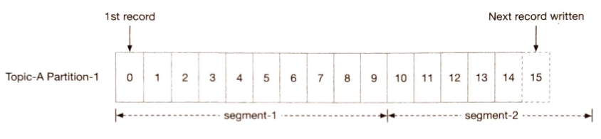
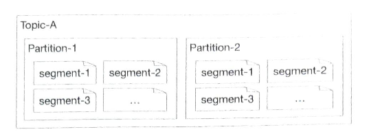
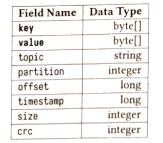
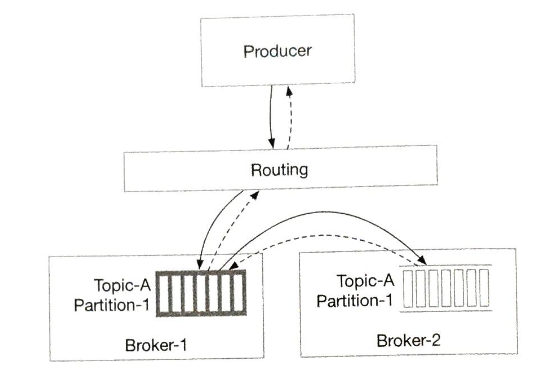
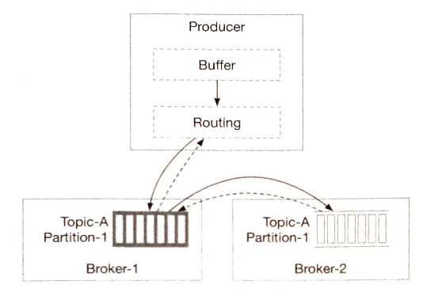
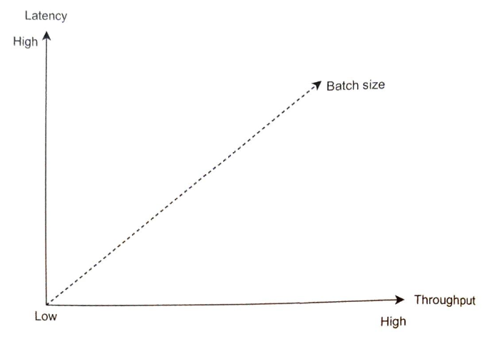
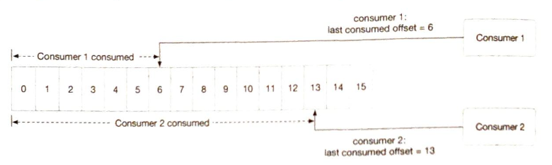

# 第四章 分布式消息队列

在本章中，我们将探讨一个系统设计面试中的常见问题：设计一个分布式消息队列。在现代架构中，系统被拆分成小而独立的模块，模块间定义好接口。消息队列能为这些模块提供通信和协调的能力。那消息队列能带来哪些好处呢？

- 解耦。消息队列消除了组件间的紧耦合，使它们可以独立升级。

- 提高拓展性。我们可以根据负载调整生产者和消费者规模。比如，在高峰时段，可以添加更多的消费者来处理增加的流量。

- 增加可用性。如果系统的一部分下线了，其它组件仍可以和队列交互。

- 更好的性能。使用消息队列更容易异步通信。生产者可以向队列中添加消息，不用等待响应。消费者可以在可用时再消费消息。它们之间不用相互等待。

图 4.1 展示一些市面上最受欢迎的分布式消息队列

图 4.1：受欢迎的分布式消息队列

### 消息队列 vs 事件流平台

严格来说，Apache Kafka和Pulsar 不是消息队列，而是事件流平台。然而，一些类似的功能模糊了消息队列（RocketMQ、ActiveMQ、RabbitMQ、ZeroMQ等等）和事件流平台（Kafka、Pulsar）的区别。比如，RabbitMQ是一个典型的消息队列，有一个可选的流式功能，允许重复消费消息和保留长消息，它是使用仅追加日志实现的，就像事件流平台一样。Apache Pulsar是Kafka 的主要竞争对手，但它也足够的灵活和高效，可以用作典型的分布式消息队列。

在本章中，我们将设计一个包含**额外功能（比如长消息保留，重复消费消息等等）**的分布式消息队列，这些功能通常只在事件流平台有，会让设计更复杂。所以在整个章节中，我们会指出如果您的面试侧重于更传统的分布式消息队列时，可以简化设计的地方。

## 第一步 - 理解问题并确定设计范围

简而言之，消息队列基本的功能就是：生产者将消息发送到队列，消费者从队列中消费消息。除此之外，还需要考虑性能、消息传递语义、数据保存等等。下面这组问题有助于明确需求并缩小设计范围。

**候选人**：消息的格式和平均大小是多少？只有文本？还是有多媒体？

**面试官**：只有文本消息。消息通常以（KBs）为单位。

**候选人**：消息可以被重复消费吗？

**面试官**：是的，消息可以被不同的消费者重复消费。注意，这是一个附加功能。传统的分布式消息队列在消息成功传递给消费者后不会保留该消息。因此，在传统的消息队列中，消息不能被重复消费。

**候选人**：消息是否要按照生产顺序消费？

**面试官**：是的，消息应该按照生产顺序消费。注意，这是一个附加功能。传统的分布式消息队列通常不会保证传递顺序。

**候选人**：数据要持久化吗？要保留多久？

**面试官**：是的，我们假设数据要保留两周。注意，这是附加功能。传统的分布式消息队列不需要保留消息。

**候选人**：我们要支持多少个生产者和消费者？

**面试官**：越多越好。

**候选人**：我们要支持什么样的数据传输语义？比如，最多一次、至少一次或者恰好一次。

**面试官**：我们肯定要支持至少一次。理想情况下，我们应该支持所有这些语义，并能配置。

**候选人**：目标吞吐量和端到端延迟要求是什么？

**面试官**：它应该支持高吞吐量，来满足像日志聚合的使用场景。也应该支持低延迟，来满足传统消息队列的使用场景。

根据上述对话，我们可以假设有以下功能性需求：

- 生产者将消息发送到消息队列。
- 消费者从消息队列中消费消息。
- 消息可以被重复消费或只消费一次。
- 历史数据可以被截断。
- 消息大小在千字节范围内。
- 能将消息按照添加到队列中的顺序投递给消费者。
- 用户可以配置数据传输语义（至少一次、最多一次或恰好一次）。

### 非功能性需求

- 高吞吐或低延迟，可以根据使用场景配置。
- 可拓展。系统应具有分布式特性，能够支持消息量激增。
- 持久耐用。数据应持久化在磁盘上，并在多个节点间复制。

### 传统消息队列的调整

像RabbitMQ这样的传统消息队列没有事件流平台那么强烈的保留需求，消息在内存中保留的时间仅够它们被消费的。它们提供的磁盘溢出容量[1]，比事件流平台所需的容量小了几个数量级。通常也不维护消息顺序，消息消费顺序可能与生产顺序不同。这些不同点极大的简化了设计，我们将在适当的地方进行讨论。

## 第二步 - 提出高层设计并获得认可

首先，我们来讨论消息队列的基本功能。

图4.2展示了消息队列的关键组件以及组件间的简单交互。

图4.2：消息队列的关键组件

- 生产者向队列中发送消息。
- 消费者订阅队列，并消费订阅的消息。
- 消息队列是一个中间服务，它将生产者和消费者解耦，允许它们各自独立运行和拓展。
- 在客户端/服务端模型中，生产者和消费者都是客户端，而消息队列是服务端。客户端和服务端通过网络通信。

### 消息模型

最流行的消息模型是点对点和发布订阅。

#### 点对点

这种模型常见于传统消息队列。在点对点模型中，被发送到队列中的消息只能被一个消费者消费。可以有多个消费者等待消费队列中的消息，但每条消息只能被一个消费者消费。在图4.3中，消息A只被消费者1消费。

图4.3：点对点模型

一旦消费者确认消息已被消费，这条消息将从队列中移除。在点对点模型中，没有数据保留。相比之下，我们的设计包括一个持久层，将消息保存两周，允许消息被重复消费。

虽然我们的设计可以模拟点对点模型，但其功能更贴近发布-订阅模型。

#### 发布-订阅

首先，我们介绍一个新概念，主题（topic）。主题是用来组织消息的分类。在整个消息队列服务中，每个主题都有一个唯一的名字。

消息会被发送到特定的主题，也可以从特定的主题中读取消息。

在发布-订阅模型中，消息被发送到主题，并由订阅该主题的消费者消费。如图4.4所示，消息A同时被消费者1和消费者2消费。

图4.4：发布-订阅模型

我们的分布式消息队列同时支持两种模型。发布-订阅模型通过**主题**实现，点对点模型可以通过**消费组**来模拟。消费组的概念会在消费组章节介绍。

### 主题、分区和代理

如前所述，消息是按主题持久化的。如果主题中的数据量太大，单个服务器无法处理怎么办？

解决这个问题的办法之一是**分区**（partition）。如图4.5所示，我们将主题划分为分区，并将消息均匀分布在分区中。可以将分区视为主题消息的一个小的子集。分区均匀分布在消息队列集群中的各服务器上。这些保存分区的服务器被称为**代理**（broker）。在代理上分布的分区是支持高可拓展的关键。我们可以通过增加分区的数量来扩展主题容量。

图4.5：分区

每个主题分区都是以FIFO（先进先出）队列的形式进行操作。这意味着在分区内我们可以保持消息的顺序。消息在分区中的位置被称为**偏移量**（offset）。

生产者发送消息，实际上是发送到主题的分区上。每个消息都有一个可选的消息键（比如，用户ID），消息键相同的消息都会被发送到相同的分区。如果没有消息键，消息会被随机发送到一个分区上。

当一个消费者订阅一个主题时，它会从这个主题的一个或多个分区中拉取数据。当多个消费者订阅一个主题时，每个消费者都负责这个主题的部分分区。这些消费者形成了主题的**消费组**（consumer group）。

消息队列集群，包括代理和分区，如图4.6所示。

图4.6：消息队列集群

### 消费组

如前所述，我们需要同时支持点对点和发布-订阅模型。**消息组**是一组消费者，它们一起消费主题中的消息。

消费者可以被组织成消费组。每个消费组可以订阅多个主题，并维护自己的消费偏移量。比如，我们可以根据用例对消费者进行分组，计费一组，记账是另一组。

同一组中的消费者可以并行消费，如图4.7所示。

- 消费组1订阅了主题A
- 消费组2订阅了主题A和B

- 主题A同时被消费组1和2订阅，这意味着同一条消息会被多个消费者消费。这种模式支持发布-订阅模型。

图4.7：消费组

然而，这有一个问题。并行读数据提高了吞吐量，但不能保证同一分区中消息的消费顺序。比如，如果消费者1和消费者2都从分区1中读数据，我们就没法保证分区1中消息的消费顺序。

好消息是我们可以添加一个约束来修复这个问题，即一个分区只能被同一组中的一个消费者消费。如果消费组中消费者的数量大于主题中分区的数量，那么一些消费者将无法从主题中获取数据。比如，在图4.7中，主题B中的消息不能被消费组2中的消费者3消费，因为它已经被同一消费组中的消费者4消费了。

在这个约束下，如果我们把所有消费者都放在同一个消费组中，那么同一分区的消息只能被一个消费者消费，就相当于点对点模型了。分区是最小的存储单元，我们可以提前分配足够多的分区，来避免动态增加分区的数量。这样在处理高并发时，我们只需要增加消费者。

### 高级架构

图4.8展示了更新后的高级设计。

图4.8：高级设计

客户端

- 生产者：向指定主题中发送消息
- 消费组：订阅主题并消费消息

核心服务和存储

- 代理：保存多个分区。一个分区保存一个主题消息的子集。
- 存储：
  - 数据存储：消息持久化在分区的数据存储中。
  - 状态存储：消费状态由状态存储管理。
  - 元数据存储：主题的配置和属性持久化在元数据存储中。

- 协调服务
  - 服务发现：哪些代理是活跃的。
  - 领导人选举：选一个代理作为活动控制器。集群中只有一个活动控制器，负责分配分区。
  - 常用Apache ZooKeeper[2]或etcd[3]来选举控制器。

## 第3步 - 深入设计

为了满足高数据保留要求的同时实现高吞吐量，我们做出了三个重要的设计选择，现在我们详细解释一下。

- 我们选择了一种磁盘上的数据结构，它利用旋转磁盘出色的顺序访问能力和现代操作系统积极的磁盘缓存策略。
- 我们设计的消息数据结构，不需要修改消息，就可以让其从生产者传递到队列，最终传递到消费者。这最大限度地减少了复制需求，在高容量和高流量的系统中，复制是非常昂贵的。

- 我们设计了有利于批处理的系统。小I/O会阻碍高吞吐。因此，只要有可能，我们的设计就使用批处理。生产者批量发送消息。消息队列批量持久化消息。在可能的情况下，消费者也批量获取消息。

### 数据存储

现在我们来更详细地探究持久化消息这块。为了找到最佳选择，我们来考虑下消息队列的流量模式。

- 写密集型，读密集型。
- 没有更新或删除操作。顺便一提，传统的消息队列除非消息落后，否则不会持久化消息。在消息落后的情况下，当队列追上时会有删除操作。我们这里讨论的是数据流平台的持久化。
- 主要是顺序读/写。

选择1：数据库

第一个选择是使用数据库。

- 关系性数据库：创建一个主题表，并将消息以行的形式写入表。
- NoSQL数据：创建一个集合作为主题，并将消息以文档形式写入。

数据库可以处理存储需求，但并不理想，因为很难设计一个在大规模上同时支持写密集型和读密集型访问模式的数据库。数据库解决方案并不适合我们特定的数据使用模式。

这意味着数据库不是最佳选择，还可能成为系统的瓶颈。

选择2：预写日志（WAL）

第二个选择是预写日志（WAL）。WAL只是一个普通文件，新条目会被追加到一个仅追加的日志中。WAL被许多系统使用，比如MySQL中的重做日志[4]和ZooKeeper中的WAL。

我们建议将消息持久化为磁盘上的WAL日志文件。WAL是纯顺序读/写的访问模式。磁盘的顺序读写性能非常好[5]。此外，旋转磁盘的容量很大，而且价格很便宜。

如图4.9所示，新消息被追加到分区的末尾，并有一个单调递增的偏移量。最简单的选择是将日志文件的行号作为偏移量。但是，文件不能无限增长，所以将其分段是一个好主意。

分段后，新消息只会被追加到活动段文件（active segment file）中。当活动段达到一定大小时，将创建一个新的活动段来接收消息，而当前活动段会变成非活动状态，就像其它非活动段一样。非活动段仅处理读请求。如果旧的非活动段文件超过保留或容量限制，可以将其截断。

图4.9：追加新消息

同一分区的分段文件都在一个名为Partition-{:partition_id}的文件夹中。结构如图4.10所示。

图4.10：数据分段文件在主题分区中的分布

#### 磁盘性能说明

为了满足高数据保留要求，我们的设计很大程度上依赖磁盘来保存大量数据。有一种常见的误解：旋转磁盘很慢，但实际上只有随机访问的情况下很慢。对于我们的工作负载，只要我们设计磁盘上的数据结构去利用顺序访问模式，在现代RAID配置（即将磁盘条带化以提高性能）的磁盘上是可以轻松达到每秒几百兆读写速度的。这对于我们的需求是绰绰有余的，而且成本结构也很有利。

此外，现代操作系统非常积极地在主存中缓存磁盘数据，甚至愿意使用所有可用的空闲内存来缓存磁盘数据。如上所述，WAL也使用了大量操作系统磁盘缓存。

### 消息数据结构

消息的数据结构是高吞吐量的关键。它定义了生产者、消息队列和消费者之间的约定。我们的设计，通过消除消息从生产者到队列，最终到消费者这个传输过程中不必要的数据复制，来实现高性能。如果系统中的任何部分不同意这个约定，就需要变更消息，这会涉及到昂贵的复制，可能会严重影响系统的性能。

下面是消息数据结构的示例模式：

表4.1：消息数据模式

#### 消息键

消息键用来确定消息的分区，按hash(键) % 分区数选择。如果没有定义，则随机选择分区。如果我们需要更灵活，生产者可以定义自己的映射算法来选择分区。请注意，键不等于分区号。

键可以是字符串或数字。它通常带有一些业务信息。分区号是消息队列中的概念，不应该直接暴露给客户端。

使用合适的映射算法，如果分区数量发生变化，消息仍然可以均匀地发送到所有分区。

#### 消息值

消息值是消息的有效负载。它可以是纯文本或压缩的二进制块。

|提醒|
|:--|
|消息的键和值与键值（KV）存储中的键值对不同。在键值存储中，键是唯一的，我们可以通过键找到对应的值。在消息中，键不需要是唯一的，甚至不是必须的，我们也不需要通过键来查找值。|

#### 消息的其它字段

- 主题：消息所属主题的名称。
- 分区：消息所属分区的ID。
- 偏移量：消息在分区中的位置。我们可以通过三个字段的组合来找到一条消息：主题、分区、偏移量。
- 时间戳：消息存储时的时间戳。
- 大小：消息的大小。
- CRC：循环冗余检查（CRC）用来确保原始数据的完整性。

为了支持额外功能，可以根据需求添加一些可选字段。比如，如果标签是可选字段的一部分，可以按标签过滤消息。

### 批处理

批处理在这个设计中非常普遍。我们在生产者、消费者和消息队列本身中批处理消息。批处理是系统性能的关键。在本节中，我们主要关注消息队列中的批处理。稍后，我们再详细讨论生产者和消费者的批处理。

批处理是提升性能的关键，因为：

- 它允许操作系统将消息分组在一起，在单个网络请求中处理，来分摊昂贵的网络往返成本。
- 代理将消息大批量写入仅追加日志时，这些日志会加载到由操作系统维护的更大的顺序写入块和更大的连续磁盘缓存块中。两者都会大大增加顺序磁盘访问吞吐量。

吞吐量和延迟之间需要权衡。如果系统作为传统消息队列部署，那么延迟更重要，可以调整系统使用更小的批次大小。在这种情况下，磁盘的性能会受到一点影响。如果针对吞吐量进行调优，每个主题可能需要更多的分区，来弥补较慢的顺序磁盘写入吞吐量。

到目前为止，我们已经介绍了主磁盘存储子系统，及其相关的磁盘数据结构。现在，让我们换个话题，来讨论生产者和消费者流程。然后，我们再回来深入探讨消息队列的其余部分。

### 生产者流程

如果生产者想要向分区发送消息，它应该连接哪个代理？第一个选择是引入一个路由层。所有发送到路由层的消息都会被路由到“正确的”代理。如果代理有副本，那么“正确的”代理是主副本（leader replica）。我们稍后会介绍复制。

图4.11：路由层

如图4.11所示，生产者尝试向主题-A的分区-1发送消息。

1. 生产者向路由层发送消息。
2. 路由层从元数据存储中读取副本分布计划1，并缓存在本地。当消息到达时，它将消息路由到存储在代理-1中的分区-1主副本上。

> 注解1：每个分区的副本分布称为副本分布计划

3. 主副本接收消息，从副本（follower replica）从主副本拉取数据。
4. 当“足够多”的副本同步了消息，主副本提交数据（保存在磁盘上），这样数据就可以被消费了。然后它响应生产者。

你可能想知道为什么我们需要主副本和从副本，原因是容错。我们将在第113页的“同步副本”部分深入探究这个过程。

这种方法可行，但有一些缺点：

- 新的路由层有开销和额外的网络跳转，会引入额外的网络延迟。
- 请求批处理是提高效率的重要因素。这个设计没有考虑这一点。

图4.12展示了改进后的设计

图4.12：带有缓冲区和路由的生产者

路由层被封装进生产者，并在生产者中添加了一个缓冲组件。两者都可以作为生产者客户端库的一部分安装在生产者中。这个改动带来了几个好处：

- 网络跳转越少，延迟越低。
- 生产者可以有自己的逻辑来决定消息应该发送到哪个分区。
- 批处理将消息缓存在内存中，能在单个请求中发送更大批量的消息。这增加了吞吐量。

批处理大小的选择是吞吐量和延迟之间的经典权衡（图4.13）。大批次，吞吐量增加但延迟更高，因为积累批次需要更长的等待时间。小批次，请求发送更快，所以延迟更低，但吞吐量会受影响。生产者可以根据用例调整批次大小。

### 消费流程

消费者指定在分区中的偏移量，并从该位置开始接收事件。如图4.14所示。

图4.14：消费流程

#### 推 vs 拉

回答一个重要的问题：代理应将数据推送给消费者，还是消费者应该从代理拉取数据。

##### 推模型

优点：

## 参考资料

[1] Queue Length Limit. https://www.rabbitmq.com/docs/maxlength

[2] Apache ZooKeeper Wikipedia. https://en.wikipedia.org/wiki/Apache_ZooKeeper

[3] etcd. https://etcd.io

[4] MySQL. https://www.mysql.com

[5] Comparison of disk and memory performance.

[6] Push vs pull. https://kafka.apache.org/documentation/#design_pull

[7] Kafka 2.0 Documentation. https://kafka.apache.org/20/documentation.html#consumerconfigs

[8] Kafka No Longer Requires ZooKeeper. https://towardsdatascience.com/kafka-no-longer-requires-zookeeper-ebfbf3862104?gi=fe640259bf23

[9] Martin Kleppmann. Replication. In *Designing Data-Intensive Applications*, pages 151-197. O'Reilly Media, 2017.

[10] ISR in Apache Kafka. https://www.cloudkarafka.com/blog/what-does-in-sync-in-apache-kafka-really-mean.html.

[11] Global map in a geographic Coordinate Reference System. https://cwiki.apache.org/confluence/display/KAFKA/KIP-39273A+Alow+consumers+to+fetch+from+closest+replica

[12] Hands-free Kafka Replication. https:/www.confluent.io/blog/hands-free-kafka-teplication-a-lesson-in-operational-simplicity/

[13] Kafka high watermark: https://rongxinblog.wordpress.com/2016/07/29/kafka-high-watermark

[14] Kafka mirroring. https://wiki.apache.org/confluence/pages/viewpage.action?pageld=27846330.

[15] Message filtering in RocketMQdtree. https://partners-intlaliyun.com/help/doc-detail/29543.htm

[16] Scheduled messages and delayed messages in Apache RocketMQ. https://partners-intlaliyun.com/help/doc-detail/43349.htm.

[17] Hashed and hierarchical timing wheels. http://www.cs.columbia.edu/~nahum/w6998/papers/sosp87-timing-wheels.pdf.

[18] Advanced Message Queuing Protocol. https://en.wikipedia.org/wiki/Advanced_Message_Queuing_Protocol.

[19] Kafka protocol guide. https://kafka.apache.org/protocol.

[20] HDFS. https://hadoop.apache.org/docs/r1.2.1/hdfs_design.html