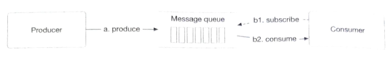
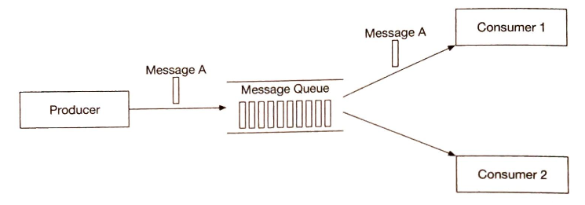
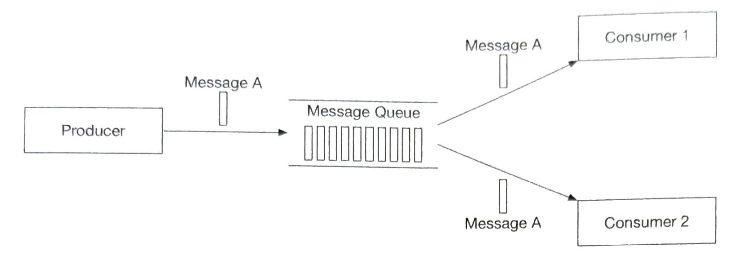
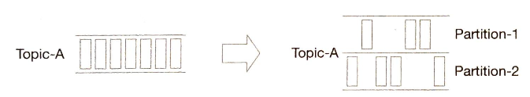
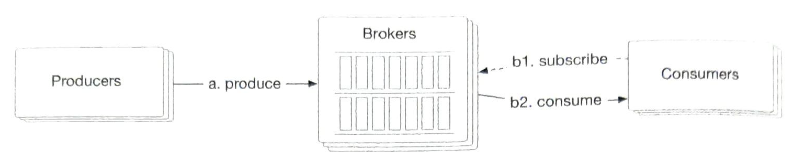
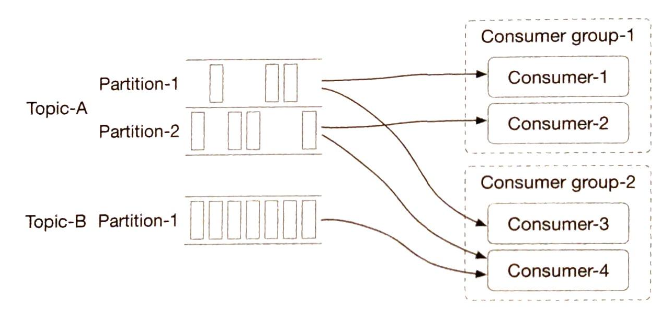
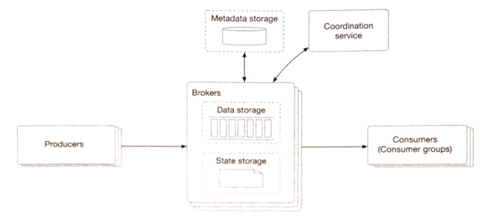

# 第四章 分布式消息队列

在本章中，我们将探讨一个系统设计面试中的常见问题：设计一个分布式消息队列。在现代架构中，系统被拆分成小而独立的模块，模块间定义好接口。消息队列能为这些模块提供通信和协调的能力。那消息队列能带来哪些好处呢？

- 解耦。消息队列消除了组件间的紧耦合，使它们可以独立升级。

- 提高拓展性。我们可以根据负载调整生产者和消费者规模。比如，在高峰时段，可以添加更多的消费者来处理增加的流量。

- 增加可用性。如果系统的一部分下线了，其它组件仍可以和队列交互。

- 更好的性能。使用消息队列更容易异步通信。生产者可以向队列中添加消息，不用等待响应。消费者可以在可用时再消费消息。它们之间不用相互等待。

图 4.1 展示一些市面上最受欢迎的分布式消息队列

图 4.1：受欢迎的分布式消息队列

### 消息队列 vs 事件流平台

严格来说，Apache Kafka和Pulsar 不是消息队列，而是事件流平台。然而，一些类似的功能模糊了消息队列（RocketMQ、ActiveMQ、RabbitMQ、ZeroMQ等等）和事件流平台（Kafka、Pulsar）的区别。比如，RabbitMQ是一个典型的消息队列，有一个可选的流式功能，允许重复消费消息和保留长消息，它是使用仅追加日志实现的，就像事件流平台一样。Apache Pulsar是Kafka 的主要竞争对手，但它也足够的灵活和高效，可以用作典型的分布式消息队列。

在本章中，我们将设计一个包含**额外功能（比如长消息保留，重复消费消息等等）**的分布式消息队列，这些功能通常只在事件流平台有，会让设计更复杂。所以在整个章节中，我们会指出如果您的面试侧重于更传统的分布式消息队列时，可以简化设计的地方。

## 第一步 - 理解问题并确定设计范围

简而言之，消息队列基本的功能就是：生产者将消息发送到队列，消费者从队列中消费消息。除此之外，还需要考虑性能、消息传递语义、数据保存等等。下面这组问题有助于明确需求并缩小设计范围。

**候选人**：消息的格式和平均大小是多少？只有文本？还是有多媒体？

**面试官**：只有文本消息。消息通常以（KBs）为单位。

**候选人**：消息可以被重复消费吗？

**面试官**：是的，消息可以被不同的消费者重复消费。注意，这是一个附加功能。传统的分布式消息队列在消息成功传递给消费者后不会保留该消息。因此，在传统的消息队列中，消息不能被重复消费。

**候选人**：消息是否要按照生产顺序消费？

**面试官**：是的，消息应该按照生产顺序消费。注意，这是一个附加功能。传统的分布式消息队列通常不会保证传递顺序。

**候选人**：数据要持久化吗？要保留多久？

**面试官**：是的，我们假设数据要保留两周。注意，这是附加功能。传统的分布式消息队列不需要保留消息。

**候选人**：我们要支持多少个生产者和消费者？

**面试官**：越多越好。

**候选人**：我们要支持什么样的数据传输语义？比如，最多一次、至少一次或者恰好一次。

**面试官**：我们肯定要支持至少一次。理想情况下，我们应该支持所有这些语义，并能配置。

**候选人**：目标吞吐量和端到端延迟要求是什么？

**面试官**：它应该支持高吞吐量，来满足像日志聚合的使用场景。也应该支持低延迟，来满足传统消息队列的使用场景。

根据上述对话，我们可以假设有以下功能性需求：

- 生产者将消息发送到消息队列。
- 消费者从消息队列中消费消息。
- 消息可以被重复消费或只消费一次。
- 历史数据可以被截断。
- 消息大小在千字节范围内。
- 能将消息按照添加到队列中的顺序投递给消费者。
- 用户可以配置数据传输语义（至少一次、最多一次或恰好一次）。

### 非功能性需求

- 高吞吐或低延迟，可以根据使用场景配置。
- 可拓展。系统应具有分布式特性，能够支持消息量激增。
- 持久耐用。数据应持久化在磁盘上，并在多个节点间复制。

### 传统消息队列的调整

像RabbitMQ这样的传统消息队列没有事件流平台那么强烈的保留需求，消息在内存中保留的时间仅够它们被消费的。它们提供的磁盘溢出容量[1]，比事件流平台所需的容量小了几个数量级。通常也不维护消息顺序，消息消费顺序可能与生产顺序不同。这些不同点极大的简化了设计，我们将在适当的地方进行讨论。

## 第二步 - 提出高层设计并获得认可

首先，我们来讨论消息队列的基本功能。

图4.2展示了消息队列的关键组件以及组件间的简单交互。

图4.2：消息队列的关键组件

- 生产者向队列中发送消息。
- 消费者订阅队列，并消费订阅的消息。
- 消息队列是一个中间服务，它将生产者和消费者解耦，允许它们各自独立运行和拓展。
- 在客户端/服务端模型中，生产者和消费者都是客户端，而消息队列是服务端。客户端和服务端通过网络通信。

### 消息模型

最流行的消息模型是点对点和发布订阅。

#### 点对点

这种模型常见于传统消息队列。在点对点模型中，被发送到队列中的消息只能被一个消费者消费。可以有多个消费者等待消费队列中的消息，但每条消息只能被一个消费者消费。在图4.3中，消息A只被消费者1消费。

图4.3：点对点模型

一旦消费者确认消息已被消费，这条消息将从队列中移除。在点对点模型中，没有数据保留。相比之下，我们的设计包括一个持久层，将消息保存两周，允许消息被重复消费。

虽然我们的设计可以模拟点对点模型，但其功能更贴近发布-订阅模型。

#### 发布-订阅

首先，我们介绍一个新概念，主题（topic）。主题是用来组织消息的分类。在整个消息队列服务中，每个主题都有一个唯一的名字。

消息会被发送到特定的主题，也可以从特定的主题中读取消息。

在发布-订阅模型中，消息被发送到主题，并由订阅该主题的消费者消费。如图4.4所示，消息A同时被消费者1和消费者2消费。

图4.4：发布-订阅模型

我们的分布式消息队列同时支持两种模型。发布-订阅模型通过**主题**实现，点对点模型可以通过**消费组**来模拟。消费组的概念会在消费组章节介绍。

### 主题、分区和代理

如前所述，消息是按主题持久化的。如果主题中的数据量太大，单个服务器无法处理怎么办？

解决这个问题的办法之一是**分区**（partition）。如图4.5所示，我们将主题划分为分区，并将消息均匀分布在分区中。可以将分区视为主题消息的一个小的子集。分区均匀分布在消息队列集群中的各服务器上。这些保存分区的服务器被称为**代理**（broker）。在代理上分布的分区是支持高可拓展的关键。我们可以通过增加分区的数量来扩展主题容量。

图4.5：分区

每个主题分区都是以FIFO（先进先出）队列的形式进行操作。这意味着在分区内我们可以保持消息的顺序。消息在分区中的位置被称为**偏移量**（offset）。

生产者发送消息，实际上是发送到主题的分区上。每个消息都有一个可选的消息键（比如，用户ID），消息键相同的消息都会被发送到相同的分区。如果没有消息键，消息会被随机发送到一个分区上。

当一个消费者订阅一个主题时，它会从这个主题的一个或多个分区中拉取数据。当多个消费者订阅一个主题时，每个消费者都负责这个主题的部分分区。这些消费者形成了主题的**消费组**（consumer group）。

消息队列集群，包括代理和分区，如图4.6所示。

图4.6：消息队列集群

### 消费组

如前所述，我们需要同时支持点对点和发布-订阅模型。**消息组**是一组消费者，它们一起消费主题中的消息。

消费者可以被组织成消费组。每个消费组可以订阅多个主题，并维护自己的消费偏移量。比如，我们可以根据用例对消费者进行分组，计费一组，记账是另一组。

同一组中的消费者可以并行消费，如图4.7所示。

- 消费组1订阅了主题A
- 消费组2订阅了主题A和B

- 主题A同时被消费组1和2订阅，这意味着同一条消息会被多个消费者消费。这种模式支持发布-订阅模型。

图4.7：消费组

然而，这有一个问题。并行读数据提高了吞吐量，但不能保证同一分区中消息的消费顺序。比如，如果消费者1和消费者2都从分区1中读数据，我们就没法保证分区1中消息的消费顺序。

好消息是我们可以添加一个约束来修复这个问题，即一个分区只能被同一组中的一个消费者消费。如果消费组中消费者的数量大于主题中分区的数量，那么一些消费者将无法从主题中获取数据。比如，在图4.7中，主题B中的消息不能被消费组2中的消费者3消费，因为它已经被同一消费组中的消费者4消费了。

在这个约束下，如果我们把所有消费者都放在同一个消费组中，那么同一分区的消息只能被一个消费者消费，就相当于点对点模型了。分区是最小的存储单元，我们可以提前分配足够多的分区，来避免动态增加分区的数量。这样在处理高并发时，我们只需要增加消费者。

### 高级架构

图4.8展示了更新后的高级设计。

图4.8：高级设计

客户端

- 生产者：向指定主题中发送消息
- 消费组：订阅主题并消费消息

核心服务和存储

- 代理：保存多个分区。一个分区保存一个主题消息的子集。
- 存储：
  - 数据存储：消息持久化在分区的数据存储中。
  - 状态存储：消费状态由状态存储管理。
  - 元数据存储：主题的配置和属性持久化在元数据存储中。

- 协调服务
  - 服务发现：哪些代理是活跃的。
  - 领导人选举：选一个代理作为活动控制器。集群中只有一个活动控制器，负责分配分区。
  - 常用Apache ZooKeeper[2]或etcd[3]来选举控制器。