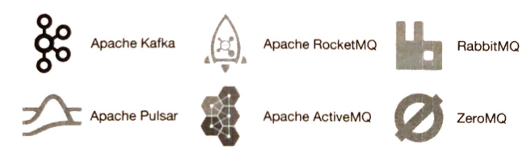

# 第四章 分布式消息队列

在本章中，我们将探讨一个系统设计面试中的常见问题：设计一个分布式消息队列。在现代架构中，系统被拆分成小而独立的模块，模块间定义好接口。消息队列能为这些模块提供通信和协调的能力。那消息队列能带来哪些好处呢？

- 解耦。消息队列消除了组件间的紧耦合，使它们可以独立升级。

- 提高拓展性。我们可以根据负载调整生产者和消费者规模。比如，在高峰时段，可以添加更多的消费者来处理增加的流量。

- 增加可用性。如果系统的一部分下线了，其它组件仍可以和队列交互。

- 更好的性能。使用消息队列更容易异步通信。生产者可以向队列中添加消息，不用等待响应。消费者可以在可用时再消费消息。它们之间不用相互等待。

图 4.1 展示一些市面上最受欢迎的分布式消息队列

图 4.1 受欢迎的分布式消息队列